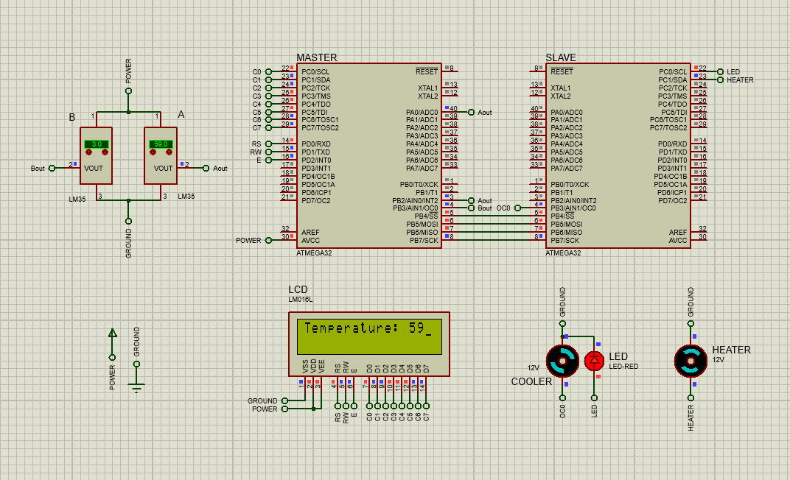

# Temperature Control System

A temperature monitoring system that controls and regulates the temperature of a particular environment.

Two ATMega32 micro-controllers was used, one to read the temperature value and another to take action upon it. Therefore, the two chips must been connected using a communication protocol (SPI was used in this case).

## Master

* Receives two temperature values A and B from two implemented LM35 sensors. (Temperatures range are between 0 to 100 degrees)

* Constantly compares the two values, as long as A is greater than B, converts the analog value of A to digital. (The conversion happens in real-time and as fast as possible therefore, no use of comparator interrupts was needed)

* Sends the digital value of A to the slave.

* Prints the digital value of A on a 16x2 alphanumeric LCD.

## Slave

* Receives the temperature value from the master.

* For temperatures between 25 and 55 degrees, the cooler motor is turned on, starting with a duty cycle of 50% plus 10% for every additional 5 degrees. (E.g., for a temperature of 37 degrees, the duty cycle is 70%)

* Turns the heater motor on if the temperature is lower than 20 degrees.

* Makes a red warning LED blink if the temperature is higher than 55 degrees. (Cooler stops working at this point)

# Setup

1. Choose a platform to code ATMega32. (PlatformIO is recommended)   
2. Build new .hex files out of the codes if you modified them, or just use the ones provided in [hex folder](proteus/hex) and load them to their corresponding ATMega32 chips in the circuit design ([proteus file](proteus/circuit.pdsprj)).  
3. Run the circuit!

## Notes

* It doesn't matter what platform you use, just set the `Micro-Controller: atmega32` and `MCU Frequency: 8000000L`. (For example in PlatformIO you must set `board_build.mcu` and `board_build.f_cpu` in **platformio.ini** file to the mentioned values)

* Make sure that the ATMega32 chips in the circuit design also have the same MCU Frequency as what we set in the last note.
